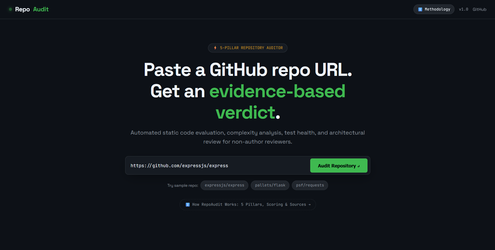
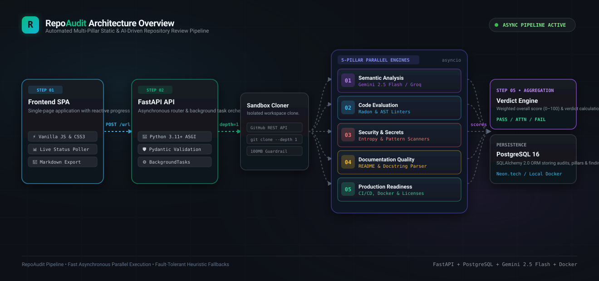

# RepoAudit 🔍

**RepoAudit** is an automated repository intelligence and review platform that takes any public GitHub repository URL and generates a comprehensive, evidence-backed evaluation across five key pillars: **Semantic Architecture Analysis**, **Code Evaluation & Complexity**, **Security & Secret Vulnerabilities**, **Documentation Quality**, and **Production Readiness**. Rather than relying on manual, ad-hoc codebase inspections or intuition, RepoAudit provides actionable scores (0–100), detailed diagnostic findings with file citations and remediation guidance, and an overall verdict (`PASS`, `NEEDS_ATTENTION`, or `FAIL`) in seconds.

---

## 🌐 Live Demo & Preview

- **Live Deployed App**: [https://repo-audit.onrender.com](https://repo-audit.onrender.com)

### Platform Interface
```
+-----------------------------------------------------------------------------------------+
|  RepoAudit // Automated Multi-Pillar Repository Intelligence                            |
|                                                                                         |
|  [ https://github.com/fastapi/fastapi                     ]  [  Run Comprehensive Audit ] |
+-----------------------------------------------------------------------------------------+
|  VERDICT: PASS (88/100)  |  Lang: Python  |  Size: 14.2 MB  |  Stars: 78.4k             |
+-----------------------------------------------------------------------------------------+
|  [Pillar 01: Semantic]      [Pillar 02: Code Eval]      [Pillar 03: Security]          |
|  Score: 92/100 (PASS)       Score: 84/100 (PASS)        Score: 95/100 (PASS)           |
|  - Modern ASGI Framework    - Clean modularity          - 0 hardcoded secrets detected  |
|  - Dependency Injection     - Cyclomatic density: low   - Safe execution patterns       |
|                                                                                         |
|  [Pillar 04: Documentation]                             [Pillar 05: Prod Readiness]     |
|  Score: 90/100 (PASS)                                   Score: 80/100 (PASS)            |
|  - Complete setup & quickstart guides                   - GitHub Actions CI configured  |
|  - High docstring coverage                              - Docker & pyproject.toml valid |
+-----------------------------------------------------------------------------------------+
```



---

## 🏗️ Architecture & System Design

RepoAudit is architected as an asynchronous, containerized pipeline engineered for rapid analysis, fault tolerance, and clean separation of concerns:



### Technology Stack
- **Backend API**: Python 3.11+ with **FastAPI** for high-throughput asynchronous execution, **Uvicorn** ASGI server, and **Pydantic v2** data modeling.
- **Frontend UI**: Responsive, zero-dependency modern SPA using Vanilla HTML5, CSS3 (JetBrains Mono & Space Grotesk typography, glassmorphism design tokens), and Vanilla JavaScript with live polling and Markdown/JSON export capabilities.
- **Database & ORM**: **PostgreSQL 16** (production) / **SQLite** (local zero-config dev) powered by **SQLAlchemy 2.0** and **Alembic** migrations.
- **AI & Static Analysis Engines**: Google GenAI SDK (`gemini-2.5-flash`), Groq Cloud API (`llama-3.3-70b-versatile`), Radon complexity analysis, Python `ast` syntax parsing, and high-entropy secret detection algorithms.

---

## 🔬 The Five Analysis Pillars

Each pillar runs independently with its own scoring heuristics, weights, and finding generators:

| Pillar | Focus & Capabilities | Underlying Engines / APIs |
| :--- | :--- | :--- |
| **01. Semantic Analysis** | Inferred application purpose, architectural patterns (MVC, Microservices, Hexagonal, CLI, etc.), key module dependency graph, data flows, and architectural risks. | **Google Gemini 2.5 Flash** (Primary Engine), with automatic fallback to **Groq Cloud** (`llama-3.3-70b-versatile`), and offline deterministic heuristic tree analysis if API quotas fail. |
| **02. Code Evaluation** | Lines of code (LOC), comments-to-code ratios, cyclomatic complexity, test file identification, deeply nested logic, and oversized files/functions. | **Radon**, Python `ast` parsing, multi-language tokenizers (Python, TS/JS, Go, Rust, Java, C++, Ruby, PHP). |
| **03. Security Analysis** | Identification of leaked high-confidence secrets (AWS keys, GitHub tokens, Slack keys, Google API keys, private RSA/PGP keys, JWTs) and dangerous execution patterns (`eval`, `exec`, `subprocess shell=True`, hardcoded credentials, SQL injection vectors). | Regex pattern matchers, Shannon entropy scanner, and AST security visitor. |
| **04. Documentation** | README quality grading (Overview, Installation, Usage, API, Contributing, Badges, License), docstring coverage calculation across functions/classes, and inline code commenting ratio. | Markdown AST tokenizer and docstring extraction engine. |
| **05. Production Readiness** | Automated CI/CD pipeline detection (GitHub Actions, GitLab CI, CircleCI), containerization (`Dockerfile`, `docker-compose`), logging framework integration, `.gitignore` sanity, and open-source license compliance. | Workflow file inspectors and environment/configuration analyzers. |

---

## 🚀 Local Setup & Docker Instructions

### Prerequisites
- [Docker Desktop](https://www.docker.com/products/docker-desktop/) (v24.0+)
- [Git](https://git-scm.com/)

### 1. Clone the Repository
```bash
git clone https://github.com/Muntaz1r/repo-audit.git
cd repo-audit
```

### 2. Configure Environment Variables
Copy the sample environment file:
```bash
cp .env.example .env
```

Edit `.env` and configure your API keys (placeholder values shown):
```ini
# Database Connection (defaults to internal postgres container in docker-compose)
DATABASE_URL=postgresql://postgres:postgres@db:5432/repo_audit

# Google AI Studio Gemini API Key (Primary Semantic Engine)
GEMINI_API_KEY=your_gemini_api_key_here

# Groq Cloud API Key (Secondary Semantic Fallback Engine)
GROQ_API_KEY=your_groq_api_key_here

# Optional: GitHub Personal Access Token (prevents rate limiting on unauthenticated GitHub API requests)
GITHUB_TOKEN=your_github_token_here

# Server Configuration
ENVIRONMENT=development
PORT=8000
MAX_REPO_SIZE_MB=100
AUDIT_TIMEOUT_SECONDS=60
```

### 3. Run with Docker Compose
Start both the FastAPI application and the PostgreSQL database:
```bash
docker-compose up --build
```

- **Web Dashboard**: Open [http://localhost:8000](http://localhost:8000) in your browser.
- **Interactive OpenAPI Docs**: [http://localhost:8000/docs](http://localhost:8000/docs).
- **PostgreSQL Database**: Accessible on port `localhost:5432`.

### 4. Running Tests Locally
To execute the automated test suite with pytest:
```bash
# Using local virtualenv
pip install -r requirements.txt
pytest
```

---

## ☁️ Deployment Notes

- **Platform Target**: Designed for low-cost / free-tier cloud environments such as **Render**, **Railway**, **Fly.io**, or **AWS ECS/Fargate**.
- **Managed Database**: Compatible with serverless Postgres providers such as **Neon.tech** or AWS RDS PostgreSQL.
- **Containerization**: Includes both production multi-stage `Dockerfile` and development `Dockerfile.dev` with live reload.
- **Free-Tier Limits to Note**:
  - **Cold Starts**: On free hosting tiers (e.g., Render Web Services), the backend service may spin down after inactivity, leading to a 30–50 second cold start on the first request.
  - **Memory Limits**: Free container tiers usually provide 512 MB RAM. Analysis is optimized with shallow git clones (`--depth 1`) and garbage collection to stay well within memory boundaries.

---

## ⚠️ Known Limitations

1. **Public Repositories Only**: The platform currently only clones and reviews public GitHub repositories; private repositories requiring OAuth2 user app delegations are not supported.
2. **Repository Size Limit (100 MB)**: Repositories with packfile sizes exceeding `MAX_REPO_SIZE_MB` (default 100 MB) or monorepos with massive binary assets are rejected to preserve server compute budgets.
3. **Audit Execution Timeout (60s)**: Analysis jobs have an enforced hard execution ceiling of 60 seconds per repository to prevent unbounded process hangs.
4. **GitHub Unauthenticated Rate Limits**: Fetching metadata without setting `GITHUB_TOKEN` limits requests to 60 req/hour per IP. If hit, RepoAudit automatically falls back to direct shallow cloning.
5. **LLM Provider Quotas**: In cases where Gemini or Groq API rate limits (HTTP 429) are exhausted, the semantic analyzer falls back to offline deterministic structural heuristics.
6. **Single-Commit / Shallow Clone**: Analysis operates on the `HEAD` snapshot (`depth=1`) rather than parsing full git history, blame, or multi-year commit telemetry.
